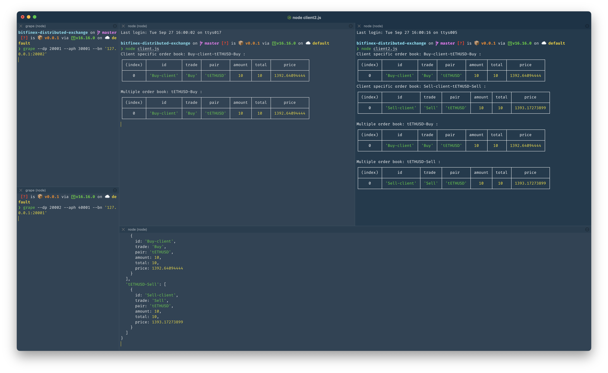

# A simplified distributed exchange




```sh
npm i -g grenache-grape
# clone the repo
git clone https://github.com/maabed/bitfinex-distributed-exchange.git

# boot two grape servers
grape --dp 20001 --aph 30001 --bn '127.0.0.1:20002'
grape --dp 20002 --aph 40001 --bn '127.0.0.1:20001'

# install deps
npm i

# run the RPC server
node server.js

# Run the Clients
node client.js
node client2.js
```

As each client is started they will send trades to the RPC server, You can change the payload of the respective clients to send different messages to the RPC server:

```js
const payload = {
  id:'buy',
  trade: 'Buy',
  pair: 'tETHUSD',
  amount: 10,
}

```
